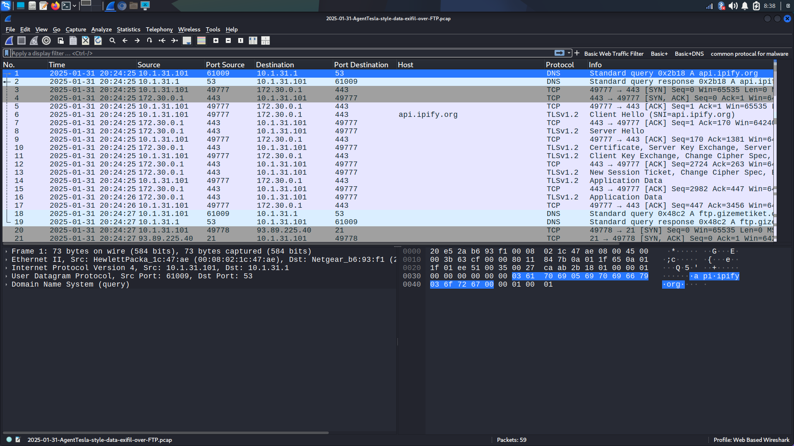
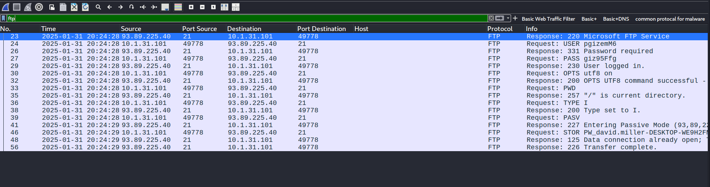
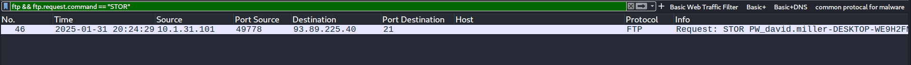
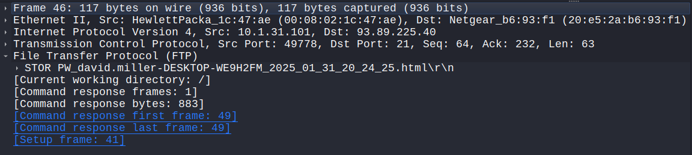
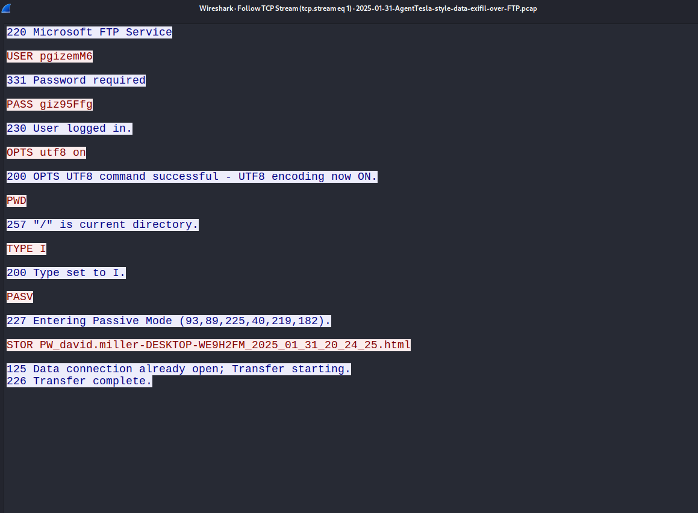

# 🔍 Wireshark Network Intrusion Detection – AgentTesla (FTP)

> ⚠️ **Disclaimer**:  
> This project specifically analyzes the PCAP sample titled  
> `2025-01-31-AgentTesla-style-data-exfil-over-FTP.pcap`  
> obtained from [Malware-Traffic-Analysis.net](https://www.malware-traffic-analysis.net/2025/01/31/index.html).  
> It is provided for **educational and research purposes** only. All findings, IPs, and credentials shown are part of a controlled malware traffic analysis environment.

---

## 📘 Project Overview

This Wireshark project demonstrates how to use packet analysis to detect and investigate a real-world data exfiltration scenario involving **Agent Tesla**, a known infostealer malware. The analysis focuses on **FTP-based exfiltration**, including detection of IOCs and plaintext credential theft.

---

## 🧠 Pre-requisites

- Basic knowledge of networking and TCP/IP
- Familiarity with FTP, TCP streams, and packet filtering
- Wireshark installed: [Download here](https://www.wireshark.org/download.html)
- Sample PCAP file downloaded and extracted using password `infected`

---

## 🧪 Exercise 1 – Load a Sample PCAP File

**PCAP File Used**: `2025-01-31-AgentTesla-style-data-exfil-over-FTP.pcap`

### ✅ Steps:
1. Open Wireshark.
2. Go to `File > Open` and load the PCAP file.
3. Observe captured packets.

### 📸 Screenshot:
<p align="center">
Figure 1: PCAP File Loaded Successfully in Wireshark <br/>

</p> 

---

## 🧪 Exercise 2 – Identify Indicators of Compromise (IOCs)

### 🔍 Observations:
- **Suspicious FTP connection** from internal IP `10.1.31.101` to external FTP server `93.89.225.40`
- Use of `STOR` command to upload file with likely stolen credentials
- FTP credentials passed in plaintext

### 📌 Notable IOCs:

| Type         | Value                        | Description                            |
|--------------|------------------------------|----------------------------------------|
| IP Address   | 93.89.225.40                 | External FTP server                    |
| IP Address   | 10.1.31.101                  | Internal infected host                 |
| FTP Command  | `STOR`                       | File upload action                     |
| Filename     | `PW_david.miller-...html`    | Exfiltrated credential log             |

### 📸 Screenshot:
<p align="center">
Figure 2: Applying FTP Filter in Wireshark <br/>

</p> 
<p align="center">
Figure 3: Identifying IOC via FTP File Upload Filter <br/>

</p> 
---

## 🧪 Exercise 3 – Analyze Suspicious Packets

### 🧾 Packet Details:
- **Frame Number**: 46
- **Source Port**: 49778
- **Destination Port**: 21 (FTP)
- **Command**: `STOR PW_david.miller-DESKTOP-WE9H2FM_2025_01_31_20_24_25.html`

### 🧠 Interpretation:
This packet shows the malware attempting to upload a credential log file using FTP. The file name suggests it contains password data exfiltrated from the victim's machine.

### 📸 Screenshot:
<p align="center">
Figure 4: Analyzing FTP Packet with STOR Command <br/>

</p> 

---

## 🧪 Exercise 4 – Follow the Intrusion’s Communication Stream

### 🧵 Stream Analysis:

Captured from TCP Stream 1:

```plaintext
USER pgizemM6
PASS giz95Ffg
...
STOR PW_david.miller-DESKTOP-WE9H2FM_2025_01_31_20_24_25.html
226 Transfer complete.
```

### 🔍 Key Insights:

- FTP login was successful  
- File containing exfiltrated data was uploaded  
- No encryption or security measures were in place  

### 📸 Screenshot:
<p align="center">
Figure 5: Viewing FTP Credential and Upload via TCP Stream <br/>

</p> 

---

## 🧾 Exercise 5 – Document and Report Findings

### 🔐 Summary:

- The infected host authenticated to an external FTP server using hardcoded credentials and uploaded a `.html` file likely containing passwords.  
- The exfiltration occurred in plaintext over FTP, with no security.  

---

### 🛡️ Recommendations for Prevention

1. **Disable FTP** and use **SFTP/FTPS** for secure file transfer.  
2. **Deploy IDS/IPS** (e.g., Suricata, Snort) to detect FTP uploads and credential leaks.  
3. **Implement outbound firewall rules** to restrict access to unknown IPs.  
4. **Harden endpoints** using EDR tools to detect malware like Agent Tesla.  
5. **Use network segmentation** to prevent lateral movement.  
6. **Apply least privilege and rotate credentials regularly.**  

---

### 🔑 Steps to Remediate Compromised Credentials

- Immediately **revoke credentials**: `pgizemM6 / giz95Ffg`  
- Scan the infected host for malware and persistence mechanisms.  
- Audit FTP logs for similar activity.  
- If applicable, remove the uploaded `.html` file from the external server.  
- Enable **MFA** where supported to reduce impact of exposed passwords.  

---

## 📚 References

- [Agent Tesla Overview (MITRE ATT&CK)](https://attack.mitre.org/software/S0331/)  
- [Wireshark FTP Analysis Guide](https://wiki.wireshark.org/FTP)  
- [Malware-Traffic-Analysis.net PCAP Archive](https://www.malware-traffic-analysis.net/)  

---

## ✅ Author

This project was completed as part of a cybersecurity learning series focused on using Wireshark for practical malware and intrusion analysis.  
