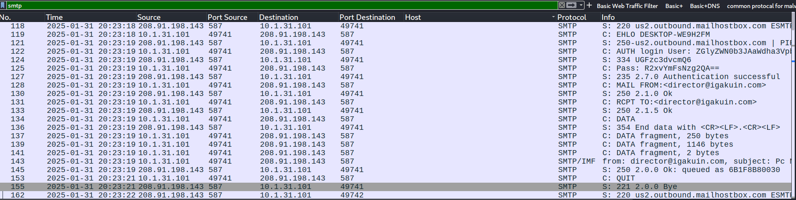
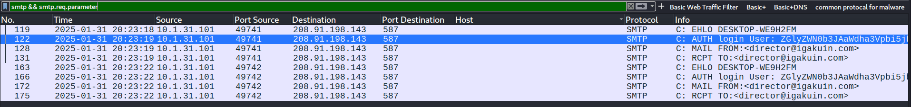
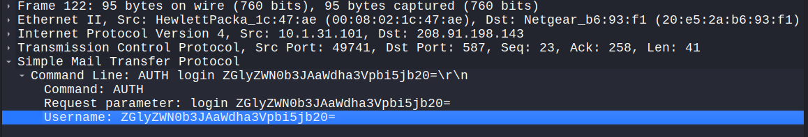
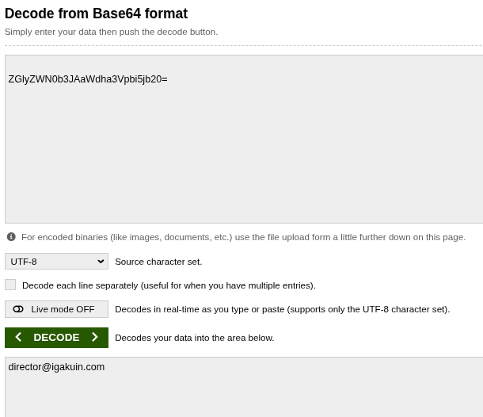
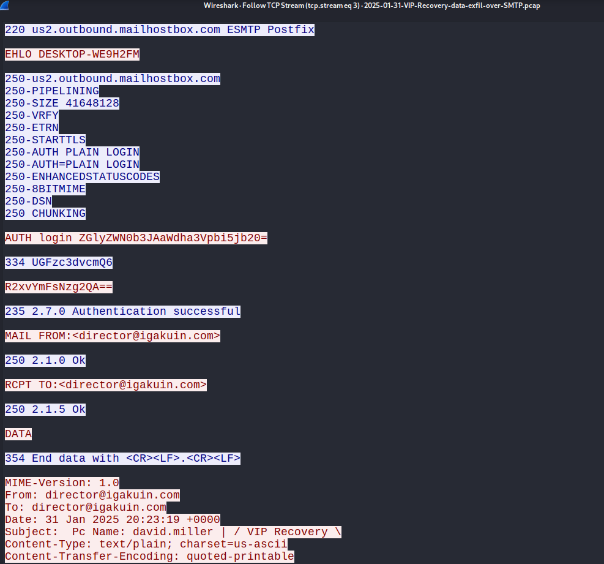
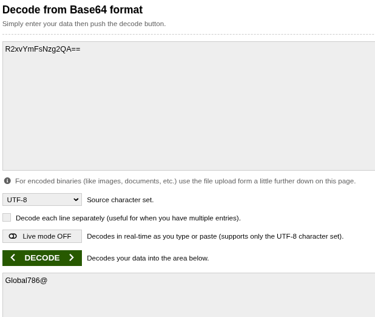
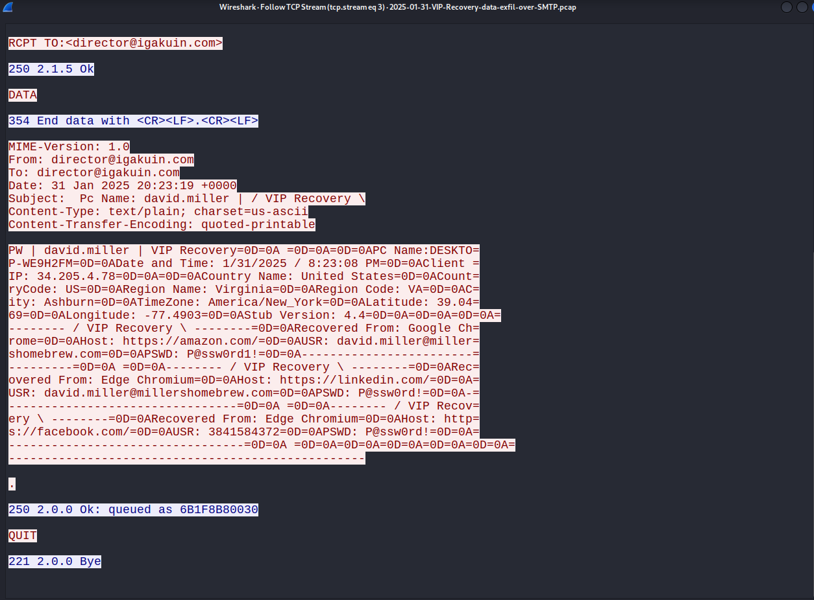

# 📧 Wireshark Network Intrusion Detection – AgentTesla (SMTP)

> ⚠️ **Disclaimer**:  
> This project analyzes the PCAP file titled  
> `2025-01-31-VIP-Recovery-data-exfil-over-SMTP.pcap`  
> obtained from [Malware-Traffic-Analysis.net](https://www.malware-traffic-analysis.net/2025/01/31/index.html).  
> It is intended strictly for **educational and research purposes**.

---

## 📘 Project Overview

This analysis demonstrates how to use Wireshark to investigate SMTP-based credential theft and data exfiltration related to **Agent Tesla**, an infostealer malware. The attacker used **SMTP port 587** to authenticate and send an email containing stolen host information.

---

## 🧠 Pre-requisites

- Understanding of email protocols (SMTP)
- Basic Wireshark and TCP/IP knowledge
- Sample PCAP file extracted (password: `infected`)

---

## 🧪 Exercise 1 – Load the PCAP File

- **PCAP**: `2025-01-31-VIP-Recovery-data-exfil-over-SMTP.pcap`

---

## 🧪 Exercise 2 – Identify Indicators of Compromise (IOCs)

### 🔍 Observations:
- SMTP `AUTH LOGIN` commands found in packets #122 and #166
- Authentication done in Base64 → Decoded using base64decode.org
- Both `MAIL FROM` and `RCPT TO` used same exfil account

### 🧾 IOC Table

| Type            | Value                            | Description                          |
|-----------------|----------------------------------|--------------------------------------|
| SMTP Server     | us2.outbound.mailhostbox.com     | External mail server used            |
| Port            | 587                              | SMTP with optional encryption        |
| Username        | director@igakuin.com             | Exfil account                        |
| Password        | Global786@                       | Base64-decoded password              |
| Subject Line    | "VIP Recovery"                   | Email used to exfil stolen info      |
| Origin Host     | 10.1.31.101                      | Infected internal machine            |
| Destination IP  | 208.91.198.143                   | Mailhostbox SMTP endpoint            |

### 📸 Screenshot:
<p align="center">
Figure 1: Filter SMTP <br/>

</p> 
<p align="center">
Figure 2: Filtering SMTP Packets to Locate Authentication Attempts <br/>

</p> 


---

## 🧪 Exercise 3 – Analyze Suspicious Packets

### 🔐 Captured Credentials:

| Field       | Encoded Base64                       | Decoded                  |
|-------------|---------------------------------------|--------------------------|
| Username    | ZGlyZWN0b3JAaWdha3Vpbi5jb20=          | director@igakuin.com     |

### 💬 Interpretation:

- Malware authenticates to external SMTP server
- Uses valid credentials in base64 over plaintext
- Confirms attacker control over exfiltration destination

### 📸 Screenshot:
<p align="center">
Figure 3: Inspecting SMTP Packet for AUTH LOGIN Command <br/>

</p> 
<p align="center">
Figure 4: Decoding Base64-Encoded SMTP Username<br/>

</p> 
---

## 🧵 Exercise 4 – Follow the Intrusion’s Communication Stream

### 🔍 Full SMTP Email Captured:

```
MAIL FROM:<director@igakuin.com>
RCPT TO:<director@igakuin.com>
Subject: PC Name: david.miller / VIP Recovery
```

**Message Body Highlights** (decoded from quoted-printable):

- **PC Name**: DESKTOP-WE9H2FM
- **User**: david.miller
- **Public IP**: 34.205.4.78
- **Location**: Virginia, United States
- **Timezone**: America/New_York
- **Stub Version**: 4.4
- **Recovered Credentials**:
  - From Google Chrome: `david.miller@millershomebrew.com : @Pssw0rd1`
  - From LinkedIn: `david.miller : @Pssw0rd1`
  - From Facebook: `38415843722 : @Pssw0rd1`

### 📸 Screenshot:
<p align="center">
Figure 5: Viewing SMTP Communication in TCP Stream <br/>

</p> 
<p align="center">
Figure 6: Decoding Email Body from Quoted-Printable Format <br/>

</p> 
<p align="center">
Figure 7: Extracted Credentials and Metadata from TCP Stream <br/>

</p> 
---

## 🧾 Exercise 5 – Report & Remediation

### 📤 Data Exfiltrated

The TCP stream revealed a **"VIP Recovery" log** exfiltrated via email, which included:

- Device identity and location metadata
- Public IP and timezone
- Browser-saved credentials for Amazon, LinkedIn, Facebook
- Password reuse across multiple services

### 🚨 Threat Assessment

This level of information leakage is critical and allows for:

- Account takeover via credential stuffing
- Social engineering and phishing attacks
- Targeted exploitation

### 🛡️ Recommendations

1. **Block outbound SMTP (port 25/587)** from non-mail servers
2. **Deploy email DLP and IDS** to detect suspicious external email sends
3. **Alert on Base64 AUTH LOGIN sequences** in network traffic
4. **Enforce strong endpoint protection and EDR detection rules**
5. **Audit and rotate exposed credentials**

### 🔑 Compromised Credential Response

- Immediately revoke: `director@igakuin.com / Global786@`
- Notify affected users of `@millershomebrew.com`
- Review host for Agent Tesla artifacts and persistence mechanisms
- Enable MFA for accounts found in the recovered dump

---

## 📚 References

- [Agent Tesla (MITRE ATT&CK)](https://attack.mitre.org/software/S0331/)
- [SMTP Traffic in Wireshark](https://wiki.wireshark.org/SMTP)
- [Malware Traffic Analysis - PCAP Archive](https://www.malware-traffic-analysis.net/)

---

## ✅ Author

This walkthrough was developed as part of a hands-on learning exercise in network-based malware detection using Wireshark.
